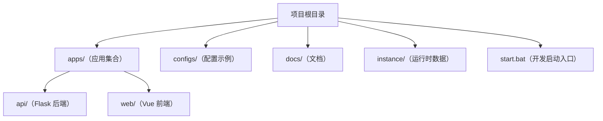

# 项目目录结构设计

## 目标

- 让“代码归代码、配置归配置、运行数据归运行数据”，避免混放导致的维护成本上升。
- 让新同学可以在 1 分钟内找到：后端入口、前端入口、文档入口、运行时数据位置。
- 让未来引入桌面端（PyQt5）或其他应用时，不需要再次大规模搬家。

## 顶层约定

- `apps/`：所有“可运行的应用”（后端、前端、未来桌面端等）。
- `configs/`：部署/代理/系统相关配置示例（如 Nginx）。
- `docs/`：设计/使用/规范文档（面向小白、配 Mermaid 图）。
- `instance/`：运行时数据（数据库、缓存、备份、日志）。禁止提交到版本库。
- 根目录脚本：只保留“入口型脚本”（如 `start.bat`），复杂脚本建议后续集中到 `scripts/`。

## 当前目录结构

```
apps/
  api/
    app/
      api/
        v1/           # HTTP API（/api/v1）
      realtime/       # Socket.IO 事件
    main.py
    serve.py
    requirements.txt
  web/
    src/
      pages/          # 页面（原 views）
        settings/     # 设置相关页面
    vite.config.js
    package.json
configs/
  nginx.conf.example
docs/
  design/
  use/
  standard/
instance/
start.bat
```

## Mermaid 结构图



## 运行时目录（instance）规范

- 后端配置中的 `INSTANCE_PATH` 指向 `instance/`，作为“唯一真实的运行时目录”。
- 允许内容：
  - 数据库：`manga_manager_dev.db`、`manga_manager.db`
  - Huey：`huey.db`
  - 封面缓存：`covers/`
  - 备份：`backups/`
  - 日志：`logs/`
- 禁止把运行时内容放到 `apps/api/instance`、`apps/web/dist`、`apps/web/node_modules` 之类目录里。
