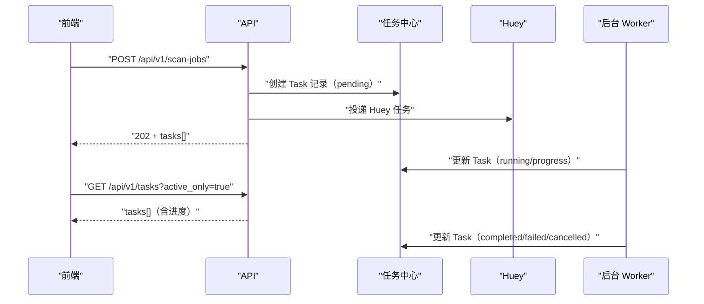

# RESTful API 设计（design）

## 目标

- 统一全工程的 HTTP 接口风格：**RESTful、资源化、可预测**。
- 前后端解耦：前端只依赖资源与语义，不依赖“动词式 RPC”接口。
- 长耗时操作可观测：扫描/批量重命名/标签批处理等统一纳入任务中心。

## 核心约定

### 1) 统一前缀与版本

- API 统一挂载：`/api/v1`
- 新增接口必须进入 v1（或未来的新版本），禁止在根路径散落接口。

### 2) URL 资源化

- 路径使用 **名词** 表达资源，使用 **kebab-case**（短横线）。
- 集合资源使用复数：如 `library-paths`、`tag-types`、`backups`。
- 子资源使用层级表达：如 `files/{id}/pages/{page}`、`files/{id}/cover`。

### 3) HTTP 方法语义

- `GET`：只读查询，必须“安全”（不写库、不产生副作用）。
- `POST`：创建资源/创建任务/触发一次性操作（有副作用）。
- `PUT`：替换更新（编辑页提交完整对象时使用）。
- `PATCH`：局部更新（阅读进度、单文件重命名等）。
- `DELETE`：删除资源/清理历史（有副作用）。

### 4) 状态码约定

- `200`：成功（查询/更新）。
- `201`：创建成功（创建备份、创建标签等）。
- `202`：已接受（提交异步任务）。
- `204`：成功但无返回体（删除/幂等添加）。
- `400`：参数错误。
- `404`：资源不存在。
- `409`：冲突（重复、正在执行的任务等）。
- `500`：服务器内部错误。

### 5) 错误返回格式

当前统一使用：

```json
{ "error": "中文错误信息" }
```

## 任务模型（异步操作）

- 长耗时操作通过创建任务记录实现可观测：
  - 扫描：`POST "/api/v1/scan-jobs"`
  - 批量重命名：`POST "/api/v1/rename-jobs"`
  - 标签批处理：`POST "/api/v1/tag-file-changes"` / `POST "/api/v1/tag-splits"` / `POST "/api/v1/tag-merges"`
- 任务查询：
  - `GET "/api/v1/tasks"`
  - `GET "/api/v1/tasks/{id}"`
  - `GET "/api/v1/tasks/{id}/status"`
- 任务取消（仅标记取消，是否真正停止取决于后台任务实现）：
  - `PATCH "/api/v1/tasks/{id}"` + `{ "status": "cancelled" }`
- 清理历史任务：
  - `DELETE "/api/v1/task-history"` + `{ "days": 30 }`



## 资源清单（v1）

### 图书馆路径

- `GET "/api/v1/library-paths"`：列表
- `POST "/api/v1/library-paths"`：创建
- `DELETE "/api/v1/library-paths/{id}"`：删除

### 扫描任务

- `POST "/api/v1/scan-jobs"`：
  - 单路径：`{ "library_path_id": 1 }`
  - 多路径：`{ "library_path_ids": [1,2] }`
  - 全部：`{ "all": true }`（或空请求体）

### 文件

- `GET "/api/v1/files"`：列表（筛选/分页/排序）
- `GET "/api/v1/files/{id}"`：详情
- `PUT "/api/v1/files/{id}"`：更新（主要用于 tags 编辑）
- `PATCH "/api/v1/files/{id}"`：局部更新（阅读进度/状态、单文件重命名）
- `GET "/api/v1/files/{id}/pages/{page}"`：页面图片（页码从 0 开始；可选缩放参数：`max_side_px`/`format`/`quality`/`resample`）
- `GET "/api/v1/files/{id}/pages/{page}/metadata"`：页面元数据
- `GET "/api/v1/files/{id}/cover"`：封面
- `GET "/api/v1/stats/files"`：统计信息

### 书签

- `GET "/api/v1/files/{file_id}/bookmarks"`
- `POST "/api/v1/files/{file_id}/bookmarks"`
- `PUT "/api/v1/bookmarks/{bookmark_id}"`
- `DELETE "/api/v1/bookmarks/{bookmark_id}"`

### 喜欢

- `GET "/api/v1/likes"`：喜欢列表
- `PUT "/api/v1/likes/{file_id}"`：添加（幂等）
- `DELETE "/api/v1/likes/{file_id}"`：移除（幂等）

### 备份

- `GET "/api/v1/backups"`：备份列表（文件名/时间/大小）
- `POST "/api/v1/backups"`：创建备份
- `POST "/api/v1/backup-restores"`：从备份还原（需要重启生效）

### 维护与报表

- `GET "/api/v1/reports/duplicate-files"`：重复文件分组
- `POST "/api/v1/missing-file-cleanups"`：清理缺失文件记录
- `POST "/api/v1/integrity-checks"`：完整性检查任务
- `GET "/api/v1/reports/undefined-tags"`：扫描未定义标签

### 标签与类型

- `GET "/api/v1/tag-types"` / `POST "/api/v1/tag-types"` / `PUT "/api/v1/tag-types/{id}"` / `DELETE "/api/v1/tag-types/{id}"`
- `GET "/api/v1/tags"` / `POST "/api/v1/tags"` / `GET "/api/v1/tags/{id}"` / `PUT "/api/v1/tags/{id}"` / `DELETE "/api/v1/tags/{id}"`
- `GET "/api/v1/tag-tree"`：树形标签
- `GET "/api/v1/tag-suggestions"`：建议（下拉框）
- `GET "/api/v1/tag-suggestions/related"`：相关推荐
- `POST "/api/v1/tags/{id}/aliases"`：新增别名
- `DELETE "/api/v1/tag-aliases/{alias_id}"`：删除别名
- `PUT "/api/v1/files/{file_id}/tags/{tag_id}"`：为文件添加标签（幂等）
- `DELETE "/api/v1/files/{file_id}/tags/{tag_id}"`：移除标签（幂等）

### 标签批处理（任务化）

- `POST "/api/v1/tag-file-changes"`：批量删除/重命名标签（影响文件名）
- `POST "/api/v1/tag-file-changes/preview"`：预览
- `POST "/api/v1/tag-splits"`：拆分标签（影响文件名）
- `POST "/api/v1/tag-splits/preview"`：预览
- `POST "/api/v1/tag-merges"`：合并标签

### 设置

- `GET "/api/v1/settings"`：全部设置
- `GET "/api/v1/settings/{key}"`：单项设置
- `PUT "/api/v1/settings/{key}"`：创建/更新
- `DELETE "/api/v1/settings/{key}"`：删除覆盖值（回退默认值）
