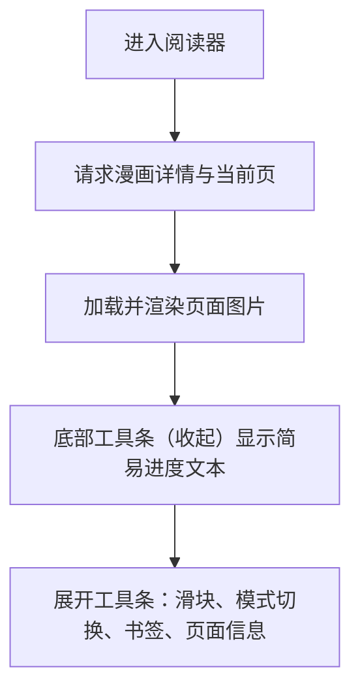

# 阅读器

## 设计目的

- 提供本地漫画的沉浸式阅读体验。
- 支持翻页、跳页、分栏/跨页模式、书签与页面信息查看。
- 在不干扰画面的前提下，提供可收起的底部工具条。

## 整体设计

## 模块介绍

- 前端页面：`frontend/src/views/ReaderView.vue`
  - 画布区域：渲染当前页图片，左右点击区域用于翻页。
  - 底部工具条：
    - 收起状态：展示简易进度文本（如“2 / 38”），文本居中显示，点击展开。
    - 展开状态：进度条显示在上方，页码显示在操作按钮左侧，并提供滑块跳页、模式切换、书签列表、新增书签、页面信息面板（表格分隔线与边框保持一致）。
  - 面板表格：书签/文件信息使用统一的暗色悬浮底色，空数据占位行悬浮不会变成纯白底。
  - 表格分隔线：行间分隔线使用单一 1px 线条（不叠加上下边线），颜色与表格边框一致。

## 使用场景

- 快速浏览：单击左右区域翻页，底部收起工具条提供当前进度提示。
- 精确跳页：展开工具条，拖动滑块跳转到指定页。
- 标注重点：在展开工具条中新增书签，后续从书签列表快速跳转。

## 使用方法

- 进入阅读器后，点击左右区域进行上一页/下一页。
- 左上角“返回书库”按钮仅保留左箭头图标，样式与底部进度模块一致。
- 点击画面偏中心区域，可在简易/详细进度模式之间切换底部工具条。
- 点击底部工具条（收起状态）可展开控制面板。
- 键盘快捷键以阅读器页面内逻辑为准（例如翻页、展开/收起等）。

## 可配置项

- 进入“设置” -> “阅读器设置”（`/settings/reader`）可调整：
  - 预加载后续页数
  - 默认开启分栏模式
  - 宽图判定阈值（宽/高）
  - 工具条动画时长（毫秒）
  - 工具条背景透明度
  - 点击画面中部切换工具条
